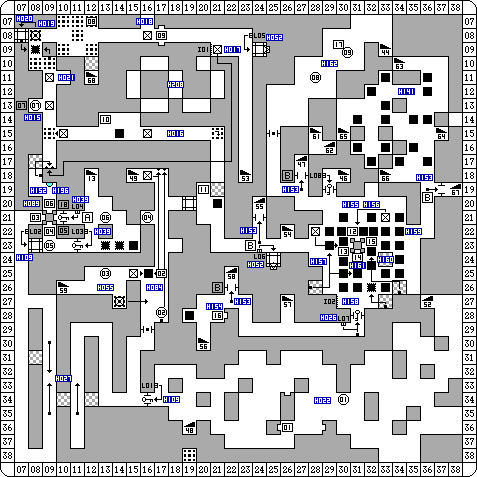

#Projet Court ISN : Labyrinthes

--- 

#Quelques exemples

---
## Création des matrices avec numpy

## Sauvegarde des matrices avec numpy

	!python
	import numpy
	# exemple de matrice
	X=numpy.random.random((5,3))
	# sauvegarde de la matrice dans un fichier:
	numpy.save('test.npy',X)
	# lecture de la matrice contenu dans le fichier
	Y=numpy.load('test.npy')
	# test d'égalité de matrices
	print ((X-Y==0).all())

Sortie:

	True
	
---

## Animation avec PyGame

	!python
	import sys, pygame
	pygame.init()
	size = width, height = 320, 240
	speed = [2, 2]
	black = 0, 0, 0
	screen = pygame.display.set_mode(size)
	ball = pygame.image.load("ball.gif")
	ballrect = ball.get_rect()
	while 1:
	   for event in pygame.event.get():
		    if event.type == pygame.QUIT: sys.exit()
	   ballrect = ballrect.move(speed)
	   if ballrect.left < 0 or ballrect.right > width:
		   speed[0] = -speed[0]
	   if ballrect.top < 0 or ballrect.bottom > height:
		   speed[1] = -speed[1]
	   screen.fill(black)
	   screen.blit(ball, ballrect)
	   pygame.display.flip()
	   pygame.time.wait(10)
  	
Image ici :[http://www.pygame.org/docs/tut/intro/ball.gif](http://www.pygame.org/docs/tut/intro/ball.gif)

